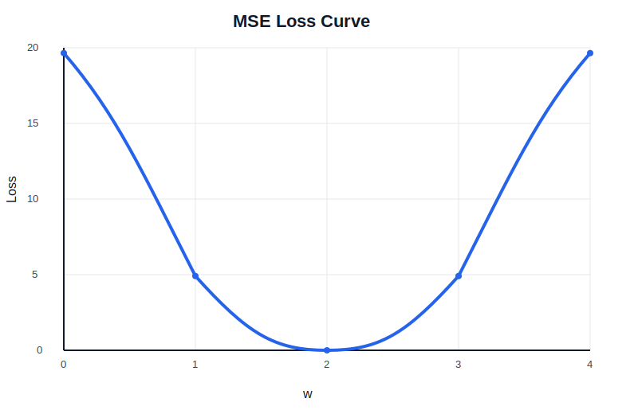
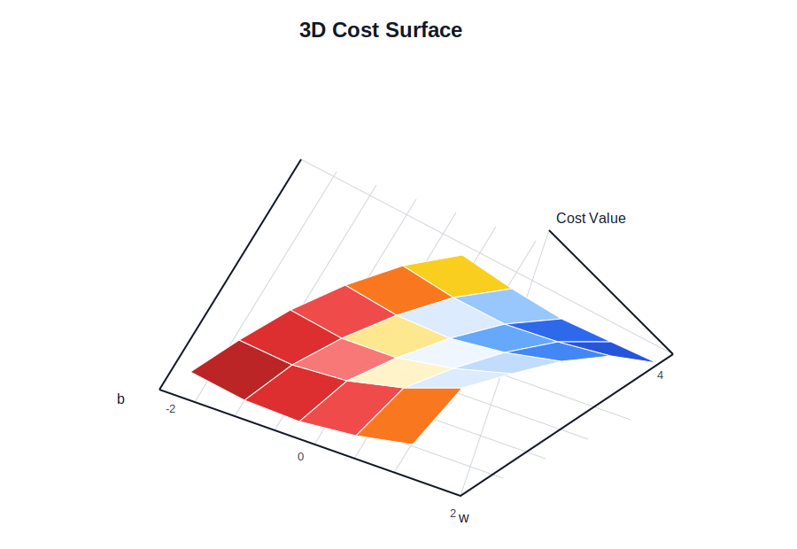

# Chapter 02: Linear Model

## Code

- `plot_2d_loss_effect.py`: plots the MSE loss curve for different `w` values.
- `plot_3d_cost_surface_effect.py`: plots the 3D cost surface for different `w` and `b` values.

## Images

### 2D loss effect

### 3D cost surface effect

The scripts also save PNG images into `images/` when run locally.
