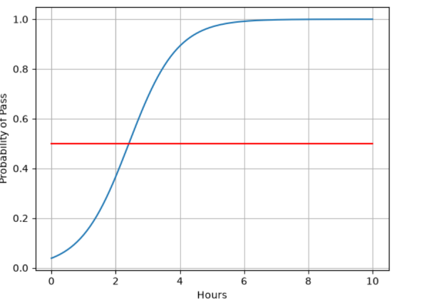

# 第 06 章：逻辑回归

本章使用 PyTorch 实现一个基于 Sigmoid 函数的概率回归模型，根据学习时长预测考试通过的概率。

## 模型原理

模型先用一个线性层计算 `z = wx + b`，再通过 Sigmoid 函数把输出映射到 0～1：

```text
P(pass | x) = sigmoid(wx + b) = 1 / (1 + exp(-(wx + b)))
```

训练数据为 `(1, 0)`、`(2, 0)` 和 `(3, 1)`。模型使用二元交叉熵损失 `BCELoss`，并通过随机梯度下降 `SGD` 更新参数。

## 运行代码

实验代码：[logistic_regression.py](./logistic_regression.py)

在仓库根目录运行：

```bash
python Chapter06_LogisticRegression/logistic_regression.py
```

## 运行结果

蓝色 S 形曲线表示模型预测的通过概率，红线表示概率为 `0.5` 的分类阈值。曲线与红线的交点对应模型学习到的决策边界。



> 模型采用随机初始化；代码通过 `torch.manual_seed(0)` 固定随机种子，使训练结果便于复现。
