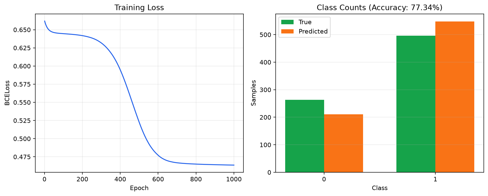

# 第 07 章：多维特征输入

本章使用糖尿病二分类示例，串联多维数据读取、神经网络前向传播、激活函数、二元交叉熵、反向传播、SGD 参数更新以及准确率计算。

## 运行示例

从仓库根目录运行：

```bash
python Chapter07_MultipleDimensionInput/diabetes_binary_classification.py
```

脚本读取 [`../datasets/diabetes.csv.gz`](../datasets/diabetes.csv.gz)：前 8 列存入 `x_data` 作为输入特征，最后一列存入 `y_data` 作为 0/1 真实标签。

## 运行效果

脚本训练 1000 轮后，会将 loss 下降曲线和真实/预测类别数量对比保存为下图：



由于代码使用 `torch.manual_seed(42)` 固定随机种子，同一运行环境下结果应基本一致。当前实验的训练 loss 约为 `0.4636`，训练准确率约为 `77.34%`。这里展示的是训练集效果，不代表模型对未知数据也能达到相同准确率。

## 模型与训练流程

完整训练链路如下：

```text
x_data
  → Linear(8, 6) → ReLU
  → Linear(6, 4) → ReLU
  → Linear(4, 1) → Sigmoid
  → 预测概率 y_pred
  → BCELoss(y_pred, y_data)
  → loss.backward() 计算梯度
  → SGD 更新各 Linear 层的 W 和 b
```

各部分的职责如下：

- `Linear` 层保存并使用可训练参数 `W` 和 `b`。
- 隐藏层的 ReLU 引入非线性，使多层网络能够学习比单一线性变换更复杂的特征关系；ReLU 本身没有需要训练的 `W` 和 `b`。
- 输出层的 Sigmoid 把任意实数压缩到 0～1，作为类别 1 的预测概率；它本身也没有可训练参数。
- `BCELoss` 用真实标签衡量预测概率的错误程度。真实标签为 1 时推动概率靠近 1，真实标签为 0 时推动概率靠近 0。
- `loss.backward()` 沿本轮前向传播建立的计算图，使用链式法则计算 loss 对各层 `W`、`b` 的偏导数。
- `optimizer.step()` 按 SGD 规则 `参数 = 参数 - 学习率 × 梯度` 更新参数；`optimizer.zero_grad()` 在每轮反向传播前清空上一轮累积的梯度。

## 参数是怎样学出来的

模型先使用当前的 `W` 和 `b` 对 `x_data` 做前向传播，再用 `y_data` 作为标准答案计算损失。`loss.backward()` 得出损失对每个参数的偏导数，SGD 根据梯度方向修改参数。多次重复“前向预测 → 计算损失 → 反向传播 → 更新参数”，模型便会逐渐找到一组使损失较小的 `W` 和 `b`。

这里的参数并不存在唯一的“正确值”；训练目标是找到一组较适合当前数据和任务、能够降低损失的参数。增加训练轮数能提供更多次调整机会，但训练过久可能过拟合；增加隐藏层能提升表达能力，但也不保证测试准确率一定提高。

## 动态计算图

每次前向传播与 loss 计算都会建立一张新的动态计算图。普通训练中，`backward()` 使用这张图计算梯度后，图中为反向传播保存的中间结果会被释放；下一轮再基于更新后的参数建立新图。

评估时使用：

```python
with torch.no_grad():
    probabilities = model(x_data)
```

`torch.no_grad()` 会关闭梯度记录，因为评估只需要前向预测，不需要建立用于反向传播的完整计算图。

## 准确率判断逻辑

先执行 `model(x_data)` 得到 Sigmoid 概率，再以 0.5 为阈值转换成类别，最后与 `y_data` 逐个比较：

```python
with torch.no_grad():
    probabilities = model(x_data)
    predictions = (probabilities >= 0.5).float()

    correct = (predictions == y_data).sum().item()
    total = y_data.numel()
    accuracy = correct / total
```

判断规则为：

```text
预测概率 >= 0.5 → 预测类别为 1
预测概率 <  0.5 → 预测类别为 0
预测类别 == 真实标签 → 判断正确
```

因此：

```text
准确率 = 判断正确的样本数 ÷ 样本总数
```

本例为了复现课件流程，训练和评估使用同一批数据，所以输出的是训练准确率。要衡量模型对未知样本的泛化能力，还应划分独立的验证集或测试集。
