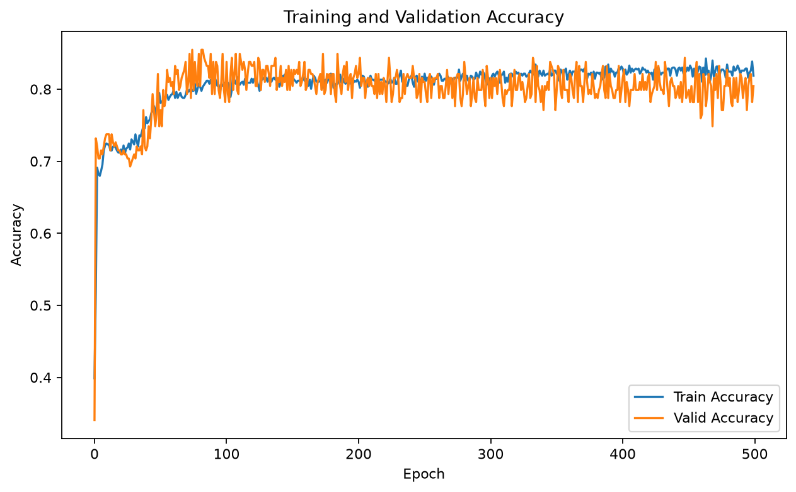

# 第 08 章：Dataset 与 DataLoader

本章通过两个独立的二分类项目练习 PyTorch 的 `Dataset`、`DataLoader`、训练/验证划分和 mini-batch 训练流程。课程讲义仍保留在本目录的 `Lecture_08_Dataset_and_Dataloader.pdf`。

## 项目目录

| 项目 | 任务 | 本章重点 | 运行结果 |
|---|---|---|---|
| [DiabetesBinaryClassification](./DiabetesBinaryClassification/) | 糖尿病二分类 | 自定义 `Dataset`、`random_split`、`DataLoader` | 验证准确率 77.63% |
| [TitanicSurvivalPrediction](./TitanicSurvivalPrediction/) | Titanic 生还预测 | CSV 清洗、`TensorDataset`、Kaggle 提交文件 | 最佳验证准确率 85.47% |

### 糖尿病二分类

该项目将第 07 章的全量训练改为标准的数据管线：从共享数据集读取样本，按 80% / 20% 划分训练集与验证集，再利用 `DataLoader` 进行 mini-batch 训练。详见 [项目 README](./DiabetesBinaryClassification/README.md)。

### Titanic 生还预测

该项目以 Kaggle Titanic 数据为例，展示缺失值处理、类别特征数值化、PyTorch 二分类训练以及生成 `submission.csv` 的完整流程。详见 [项目 README](./TitanicSurvivalPrediction/README.md)。

## 共享数据

糖尿病项目使用仓库根目录的 [`datasets/diabetes.csv.gz`](../datasets/diabetes.csv.gz)。该文件同时被第 07 章使用，因此保留在共享数据目录中。

