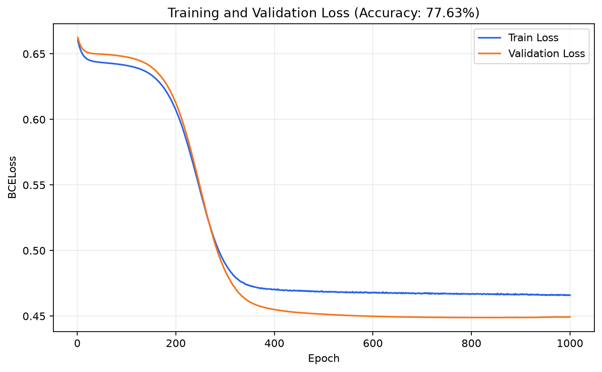

# 第 08 章：Dataset 与 DataLoader

本章在第 07 章糖尿病二分类模型的基础上，引入 PyTorch 的 `Dataset`、`random_split` 和 `DataLoader`，把数据读取、训练/验证划分与 mini-batch 训练组织成更标准的流程。

## 运行示例

从仓库根目录运行：

```bash
python Chapter08_DatasetAndDataloader/dataset_and_dataloader.py
```

脚本会读取 [`../datasets/diabetes.csv.gz`](../datasets/diabetes.csv.gz)，按照固定随机种子 `42` 划分为 80% 训练集和 20% 验证集。训练集按 32 个样本组成 mini-batch 并打乱，验证集只做前向计算，不参与参数更新。

## 运行效果

训练 1000 轮后，脚本会输出最终验证准确率，并将训练集与验证集的 loss 曲线保存为：



本次运行的最终验证准确率为 **77.63%**。固定随机种子可以使数据划分和批次顺序可复现，但不同 PyTorch 版本或硬件环境下的末位数值仍可能略有差异。

从曲线可以同时观察模型对训练数据和未参与参数更新的验证数据的拟合情况：如果训练 loss 持续下降，而验证 loss 明显回升，通常意味着模型开始过拟合。

## 数据流

```text
diabetes.csv.gz
  → DiabetesDataset
  → random_split（80% 训练 / 20% 验证）
  → DataLoader（batch_size=32）
  → DNN：8 → 6 → 4 → 1
  → BCELoss
  → SGD 更新训练集梯度
  → 验证集 loss 与准确率
```

## 原代码中的关键修正

- Python 特殊方法应写成 `__init__`、`__getitem__` 和 `__len__`，而不是 Markdown 加粗形式的 `**init**` 等。
- Matplotlib 的正确导入方式是 `import matplotlib.pyplot as plt`。
- 优化器名称是 `torch.optim.SGD`，不是 `torch.optim.SDG`。
- 使用脚本自身位置拼接数据集路径，避免因运行目录不同而找不到文件。
- 验证阶段使用 `model.eval()` 和 `torch.no_grad()`，避免记录不需要的梯度。
- loss 按样本数加权求平均，正确处理最后一个不足 32 个样本的 batch。
- 固定模型初始化、数据划分与训练集打乱的随机种子，便于复现实验。

## 训练参数

| 参数 | 设置 |
|---|---:|
| 随机种子 | 42 |
| 训练/验证比例 | 80% / 20% |
| Batch size | 32 |
| Epochs | 1000 |
| 优化器 | SGD |
| 学习率 | 0.01 |
| 损失函数 | BCELoss |

验证集只用于观察训练过程，不应被用来更新模型参数。若要给出更严格的最终泛化性能，还应额外保留独立测试集。
