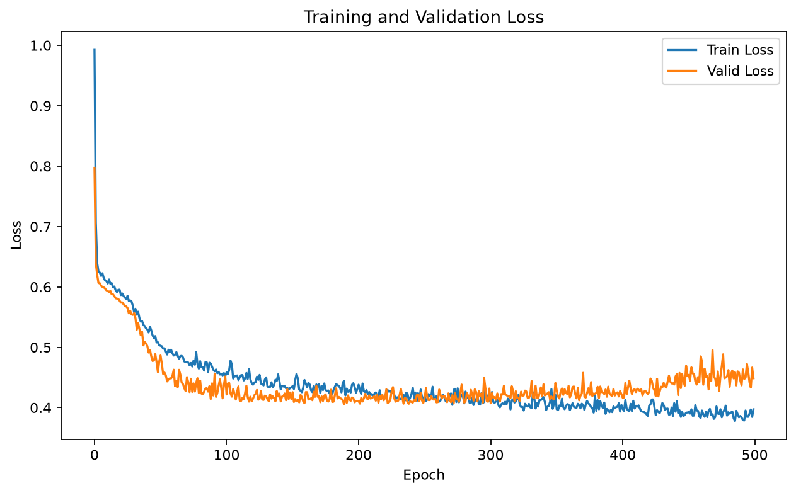

# Titanic 生还预测

本项目对应 Kaggle Titanic 生还预测任务，放在刘二大人 PyTorch 教程第 08 章 `Dataset` 与 `DataLoader` 目录下。项目展示了从 CSV 读取数据、处理缺失值、构造 `TensorDataset` / `DataLoader`、训练二分类模型，到生成 Kaggle 提交文件的完整流程。

## 文件说明

| 文件 | 类型 | 说明 |
|---|---|---|
| `train.csv` | 训练集 | 891 条样本，包含 `Survived` 标签，用于训练和验证 |
| `test.csv` | 测试集 | 418 条样本，不包含 `Survived`，用于生成最终预测 |
| `gender_submission.csv` | 官方基线提交示例 | Kaggle 提供的基线答案，不是测试集真实标签 |
| `submission.csv` | 个人提交答案 | 你提供的模型预测结果，包含 418 条 `PassengerId` / `Survived` 记录 |
| `泰坦尼克号生还预测.ipynb` | 训练与提交代码 | 数据清洗、模型训练、验证、预测和提交文件生成 |
| `images/training_validation_loss.png` | 演示图片 | 训练集与验证集损失曲线 |
| `images/training_validation_accuracy.png` | 演示图片 | 训练集与验证集准确率曲线 |

## 数据与方法

使用的 7 个输入特征为：`Pclass`、`Sex`、`Age`、`SibSp`、`Parch`、`Fare` 和 `Embarked`。

- `Age` 使用训练集年龄中位数 `28.0` 填充。
- 测试集 `Fare` 使用训练集票价中位数填充。
- `Embarked` 使用众数填充。
- `Sex` 映射为 `male=0`、`female=1`。
- `Embarked` 映射为 `S=0`、`C=1`、`Q=2`。
- 按 80% / 20% 划分训练集和验证集，随机种子为 `42`。
- 模型结构为 `7 → 16 → 8 → 1`，隐藏层使用 ReLU。
- 损失函数为 `BCEWithLogitsLoss`，优化器为 Adam，学习率为 `0.001`。
- 训练 500 个 epoch，并保存验证集准确率最高的 `best_model.pth`（该文件由 notebook 运行时生成，不提交到仓库）。

## 本次运行结果

本 notebook 已完整运行一次，得到：

- 最佳验证集准确率：**85.47%**
- 测试集预测数量：**418 条**
- `submission.csv`：保留你提供的原始提交答案

### 训练与验证损失



### 训练与验证准确率


验证集准确率仅用于观察模型在未参与参数更新的数据上的表现，不等同于 Kaggle 公榜分数。`gender_submission.csv` 是官方基线示例，不能当作测试集真实答案。

## 运行方式

建议使用 Python 3.10 或更新版本。在当前目录执行：

```bash
python -m venv .venv
```

Windows PowerShell：

```powershell
.venv\Scripts\Activate.ps1
python -m pip install -r requirements.txt
jupyter lab 泰坦尼克号生还预测.ipynb
```

Linux / macOS：

```bash
source .venv/bin/activate
python -m pip install -r requirements.txt
jupyter lab 泰坦尼克号生还预测.ipynb
```

选择 **Run All Cells** 后，notebook 会重新训练模型、更新 `best_model.pth`、覆盖 `submission.csv`，并更新 `images/` 下的两张曲线图。如果要保留当前提交答案，请在运行前备份 `submission.csv`。

