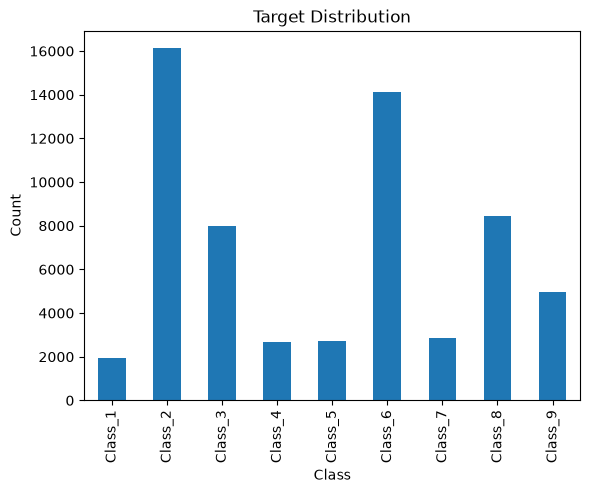

# Otto 商品多分类

本项目使用 PyTorch 对 Otto Group 商品数据进行 9 分类实验。每条样本包含 93 个匿名数值特征，目标标签为 `Class_1` 至 `Class_9`。

## 当前内容

- [奥拓物品分类.ipynb](./奥拓物品分类.ipynb)：数据读取、探索分析、分层训练/验证集划分、标准化、`Dataset`/`DataLoader` 与全连接网络草稿
- [images/target_distribution.png](./images/target_distribution.png)：从 Notebook 已保存输出中提取的真实类别分布图

## 效果展示

训练集各类别样本数分布如下，可以看到数据存在明显的类别不均衡，其中 `Class_2` 和 `Class_6` 的样本最多。



## 模型结构

Notebook 中的网络以 93 维特征作为输入，通过三层 ReLU 隐藏层输出 9 类 logits：

```text
93 → 256 → 128 → 64 → 9
```

损失函数为 `CrossEntropyLoss`，优化器为 Adam。

## 数据准备

数据文件未纳入仓库。请将 Kaggle Otto Group Product Classification Challenge 的以下文件放到 Notebook 同级目录：

```text
OttoProductClassification/
├── train.csv
├── test.csv
└── 奥拓物品分类.ipynb
```

## 运行环境

建议使用 Python 3，并安装：

```bash
python -m pip install jupyter pandas matplotlib scikit-learn torch
jupyter notebook Chapter09_SoftmaxClassifier/OttoProductClassification/奥拓物品分类.ipynb
```

## 当前进度

Notebook 已完成数据探索、预处理与模型搭建。训练循环仍是学习草稿，尚未形成可复现的完整训练指标；本 README 因此只展示 Notebook 中已有的真实数据分布结果，不虚构准确率或损失曲线。
