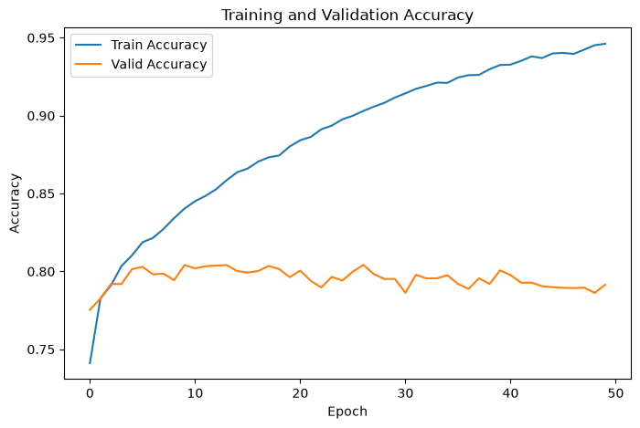

# Otto 商品多分类

本项目使用 PyTorch 对 Otto Group 商品数据进行 9 分类实验。每条样本包含 93 个匿名数值特征，目标标签为 `Class_1` 至 `Class_9`。

## 项目文件

| 文件 | 说明 |
|---|---|
| [奥拓物品分类.ipynb](./奥拓物品分类.ipynb) | 完整的数据分析、训练、验证、测试集预测与提交生成流程 |
| [train.csv](./train.csv) | 61,878 条带标签训练样本 |
| [test.csv](./test.csv) | 144,368 条测试样本 |
| [sampleSubmission.csv](./sampleSubmission.csv) | Kaggle 提交格式示例 |
| [submission.csv](./submission.csv) | 模型生成的 144,368 条九分类概率预测 |
| [best_otto_model.pth](./best_otto_model.pth) | 按验证损失保存的最佳 PyTorch `state_dict` |
| [images/](./images/) | 从 Notebook 已保存输出中提取的真实效果图 |

Jupyter 自动生成的 `.ipynb_checkpoints` 临时缓存未纳入仓库。

## 效果展示

### 类别分布

训练集存在明显的类别不均衡，其中 `Class_2` 和 `Class_6` 的样本最多。


### 损失曲线

50 轮训练中，最低验证损失为 `0.5071`，出现在第 5 轮；随后训练损失继续下降，而验证损失上升，表明模型开始过拟合。


### 准确率曲线

最高验证准确率约为 `80.42%`，最终训练准确率为 `94.61%`、验证准确率为 `79.15%`，同样体现了训练后期的过拟合。



## 模型结构

网络以 93 维特征作为输入，通过三层 ReLU 隐藏层输出 9 类 logits：

```text
93 → 256 → 128 → 64 → 9
```

- 损失函数：`CrossEntropyLoss`
- 优化器：Adam，学习率 `0.001`
- 批大小：64
- 训练轮数：50
- 数据划分：80% 训练集、20% 验证集，`random_state=42`
- 特征处理：`StandardScaler`

## 运行方式

数据、权重和提交文件已放在 Notebook 同级目录。建议使用 Python 3，并在仓库根目录执行：

```bash
python -m pip install jupyter pandas matplotlib scikit-learn torch
jupyter notebook Chapter09_SoftmaxClassifier/OttoProductClassification/奥拓物品分类.ipynb
```

请按顺序运行 Notebook 单元格。测试集预测会复用训练阶段拟合的 `scaler`，并读取 `best_otto_model.pth`，最终在项目目录生成或覆盖 `submission.csv`。
