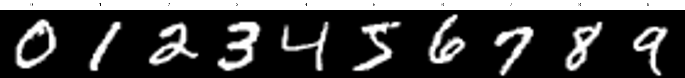

# 第 09 章：Softmax 多分类器

本章使用 MNIST 手写数字数据集完成 0–9 十分类。模型将 28×28 灰度图展平为 784 维特征，经多层全连接网络输出 10 个 logits，再由 `CrossEntropyLoss` 完成 softmax 与交叉熵计算。

## 本章项目

[MNIST 手写数字识别](./MNISTHandwrittenDigitRecognition/README.md)



项目中包含：

- 已整理的 [Notebook](./MNISTHandwrittenDigitRecognition/识别手写数字.ipynb)
- 可在终端运行的 [训练脚本](./MNISTHandwrittenDigitRecognition/train_mnist.py)
- 4 个官方压缩 IDX 数据文件；首次运行自动解压，可离线复现
- 样本展示图与完整的运行、模型和验证说明

## 快速运行

在仓库根目录执行：

```bash
python -m pip install torch torchvision matplotlib
python Chapter09_SoftmaxClassifier/MNISTHandwrittenDigitRecognition/train_mnist.py --epochs 10
```

训练完成后，指标图会生成到 `MNISTHandwrittenDigitRecognition/images/training_metrics.png`。该文件未提交，以免不同设备的运行结果彼此覆盖。
