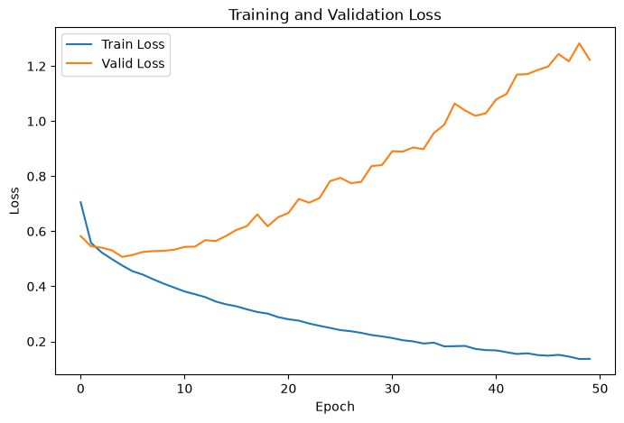

# 第 09 章：Softmax 多分类器

本章围绕多分类任务展开，使用全连接神经网络输出 logits，并通过 `CrossEntropyLoss` 完成 softmax 与交叉熵计算。

## 本章项目

### MNIST 手写数字识别

[查看项目说明](./MNISTHandwrittenDigitRecognition/README.md)


项目中包含：

- 已整理的 [Notebook](./MNISTHandwrittenDigitRecognition/识别手写数字.ipynb)
- 可在终端运行的 [训练脚本](./MNISTHandwrittenDigitRecognition/train_mnist.py)
- 4 个官方压缩 IDX 数据文件；首次运行自动解压，可离线复现
- 样本展示图与完整的运行、模型和验证说明

### Otto 商品多分类

[查看项目说明](./OttoProductClassification/README.md) · [打开 Notebook](./OttoProductClassification/奥拓物品分类.ipynb)



该项目基于 Otto Group 商品分类数据，使用 93 个数值特征预测 9 个商品类别。项目已包含完整训练集、测试集、最佳模型权重、概率预测提交文件，以及类别分布和训练曲线。50 轮实验的最低验证损失为 `0.5071`。

## 快速运行 MNIST 项目

在仓库根目录执行：

```bash
python -m pip install torch torchvision matplotlib
python Chapter09_SoftmaxClassifier/MNISTHandwrittenDigitRecognition/train_mnist.py --epochs 10
```

训练完成后，指标图会生成到 `MNISTHandwrittenDigitRecognition/images/training_metrics.png`。该文件未提交，以免不同设备的运行结果彼此覆盖。
