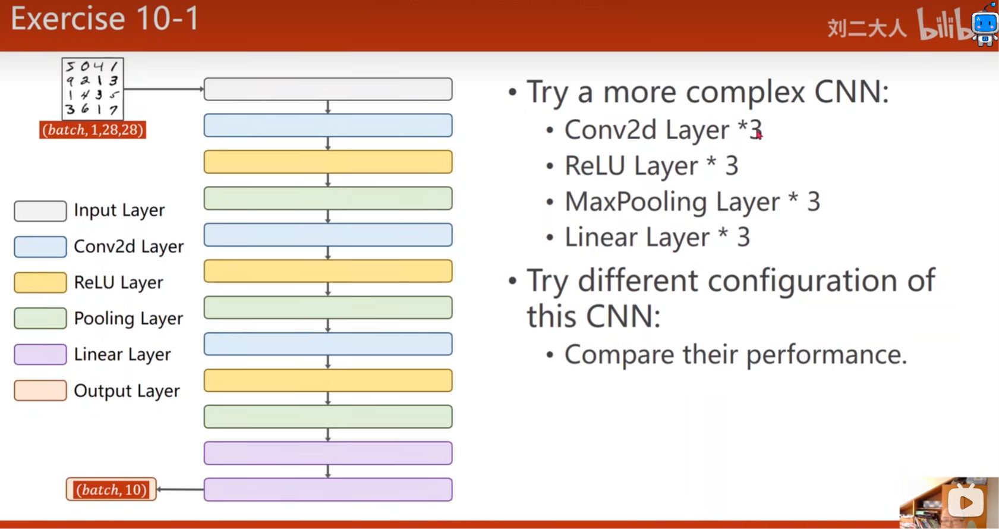

# 第 10 章：基础卷积神经网络（CNN）

本章在第 09 章 MNIST 全连接分类器的基础上，引入卷积、ReLU 与最大池化，并完成 Exercise 10-1：构建更复杂的 CNN，尝试不同通道数和全连接层宽度，比较准确率、参数量与训练时间。



## 内容

- [`Lecture_10_Basic_CNN.pdf`](./Lecture_10_Basic_CNN.pdf)：第 10 章课程课件。
- [`MNIST_CNN_Configuration_Comparison.ipynb`](./MNIST_CNN_Configuration_Comparison.ipynb)：三种 CNN 配置的完整训练、评估与可视化实验。
- `images/exercise_10_1.png`：Exercise 10-1 作业要求示意图。
- `images/cnn_configuration_comparison.png`：运行 Notebook 后自动生成的损失与准确率对比图。

## 作业目标

```text
输入 (batch, 1, 28, 28)
→ [Conv2d → ReLU → MaxPool2d] × 3
→ Linear × 3
→ 输出 (batch, 10)
```

三个 `3×3` 卷积均使用 `padding=1`，最大池化核为 `2×2`。特征图尺寸依次变化：

```text
28×28 → 14×14 → 7×7 → 3×3
```

最后一组卷积的输出经过 Flatten，再由三层全连接层映射为 10 个类别 logits。模型输出前不添加 Softmax，因为 `CrossEntropyLoss` 已在内部完成相应计算。

## 对比配置

| 模型 | 卷积通道 | 全连接隐藏层 | 侧重点 |
|---|---|---|---|
| CNN-S | `8 → 16 → 32` | `64 → 32` | 参数少、训练快 |
| CNN-M | `16 → 32 → 64` | `128 → 64` | 容量与成本均衡 |
| CNN-L | `32 → 64 → 128` | `256 → 128` | 容量更大、训练成本更高 |

为了公平比较，三组实验固定以下条件：

- MNIST 训练集与测试集相同；
- batch size 为 64；
- SGD 学习率为 0.01，momentum 为 0.5；
- 随机种子为 42；
- 默认训练 10 个 epoch。

Notebook 会输出每个模型的参数量、最佳测试准确率、最终测试准确率和训练时间，并生成三组训练曲线。第 09 章原 MLP 的一次已记录测试准确率为 97.73%，图中仅将其作为参考线；CNN 的结果以实际运行输出为准。

## 运行方式

从仓库根目录启动 Jupyter：

```bash
python -m pip install jupyter torch torchvision matplotlib
jupyter lab
```

打开：

```text
Chapter10_BasicCNN/MNIST_CNN_Configuration_Comparison.ipynb
```

Notebook 默认复用第 09 章目录中的 MNIST 数据。首次调试时可将 `EPOCHS = 10` 临时改为 `EPOCHS = 2`，确认模型尺寸、数据加载、训练与绘图均正常后再进行完整实验。

## 验证点

- Shape check 输出应为 `torch.Size([4, 10])`。
- 训练集和测试集规模应分别为 60,000 与 10,000。
- 三个模型均应完整训练，且损失整体下降。
- 对比结论应综合准确率、参数量和训练时间，不能只按模型大小判断。
- 运行结束后应生成 `images/cnn_configuration_comparison.png`。

## 实验结论模板

> 在相同数据、优化器与训练轮数下，CNN-S、CNN-M、CNN-L 的最佳测试准确率分别为 **待填写**、**待填写**、**待填写**。综合参数量和训练时间，如果 CNN-M 与 CNN-L 的准确率接近，而 CNN-M 成本更低，则 CNN-M 是更均衡的配置。
