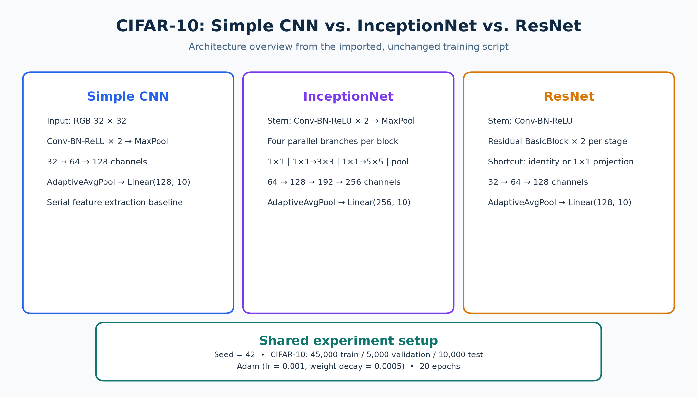
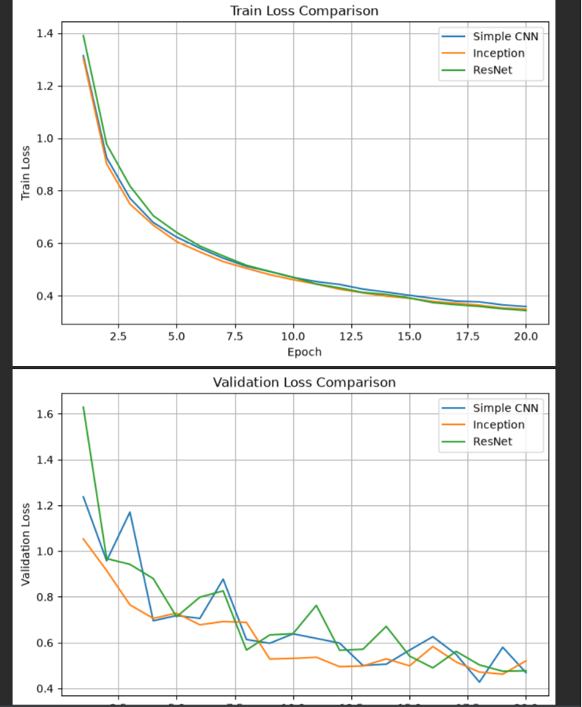
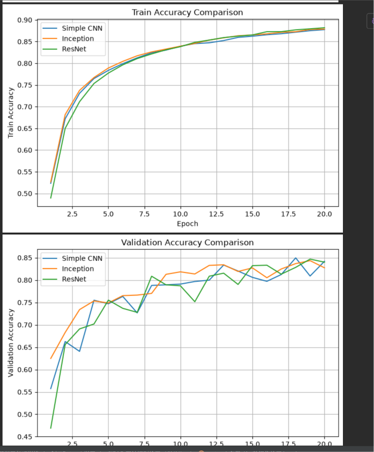

# CIFAR-10：普通 CNN、InceptionNet 与 ResNet 对比

这个实验使用同一套 CIFAR-10 划分和训练设置，依次训练普通 CNN、InceptionNet 和简化 ResNet，并在训练结束后显示训练/验证集的 Loss 与 Accuracy 对比曲线。

> 源码按提供内容原样导入，未改动训练逻辑、注释或超参数。原始文本与本文件夹中的脚本 SHA-256 均为 `E675D96378B5DDD03943ABBB1B06D4D9B02B6A743DF604FB86683906716F84BE`。



> 上图是由源码结构整理出的概览图，不是训练结果图；它不声明任何准确率或 Loss。脚本完整运行后会显示四张真实对比曲线。

## 文件

- [`cifar10_three_cnn_architectures.py`](./cifar10_three_cnn_architectures.py)：原样导入的完整训练脚本。
- [`images/cifar10_architecture_overview.png`](./images/cifar10_architecture_overview.png)：三种网络结构和共用实验设置概览。
- [`images/cifar10_loss_curves.png`](./images/cifar10_loss_curves.png)：本次训练的训练/验证 Loss 对比曲线。
- [`images/cifar10_accuracy_curves.png`](./images/cifar10_accuracy_curves.png)：本次训练的训练/验证 Accuracy 对比曲线。

## 三种模型

| 模型 | 核心思路 |
|---|---|
| Simple CNN | 三组串行卷积块提取特征，通道数依次为 32、64、128。 |
| InceptionNet | 每个 Inception Block 并行使用 `1×1`、`3×3`、`5×5` 与池化分支，再沿通道维拼接。 |
| ResNet | 通过 `F(x) + x` 残差连接保留 shortcut；尺寸或通道变化时用 `1×1` 卷积对齐。 |

## 共同实验设置

- 数据集：CIFAR-10；45,000 个训练样本、5,000 个验证样本、10,000 个测试样本。
- 数据增强：训练集使用随机裁剪和随机水平翻转；验证/测试集仅标准化。
- 随机种子：42。
- 优化器：Adam，学习率 `0.001`，权重衰减 `0.0005`。
- 训练轮数：每个模型 20 个 epoch。

## 运行方式

从仓库根目录执行：

```bash
python -m pip install torch torchvision matplotlib
cd Chapter11_AdvancedCNN/CIFAR10_Three_CNN_Architectures
python cifar10_three_cnn_architectures.py
```

首次运行会自动下载 CIFAR-10 到当前文件夹下的 `data/`。训练完成后，脚本会保存三个最佳权重文件，并依次显示：训练 Loss、验证 Loss、训练 Accuracy、验证 Accuracy 四张对比曲线。

## 实测训练曲线

以下两张图来自本次 20 个 epoch 的真实训练记录：





## 结果解读

- 三个模型的训练 Loss 都持续下降，20 个 epoch 末约为 0.34–0.36；训练 Accuracy 均接近 0.88。
- 验证 Loss 与验证 Accuracy 存在正常的批次/数据增强波动；末轮验证 Accuracy 约在 0.83–0.84 区间。
- 单次运行中 Inception 在前期验证 Accuracy 上升较快，而后期三条曲线彼此接近；不能仅据这一次曲线断言某个架构绝对更优。
- 该脚本当前只绘制训练/验证指标，虽已创建 CIFAR-10 测试集 DataLoader，但尚未输出测试集 Accuracy；不要将验证曲线当作测试集结论。

## 验证

- 已使用 `python -m py_compile cifar10_three_cnn_architectures.py` 验证脚本可解析。
- 原始提供文本与导入脚本已完成 SHA-256 一致性校验。
