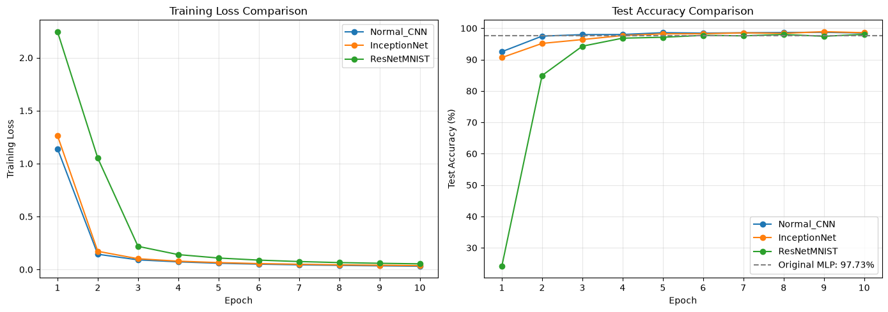

# 第 11 章：高级卷积神经网络（CNN）

本章在基础 CNN 上继续练习 Inception 多尺度分支和 ResNet 残差连接，并在 MNIST 上与普通 CNN 使用相同训练设置进行对比。



## 内容

- [`Lecture_11_Advanced_CNN.pdf`](./Lecture_11_Advanced_CNN.pdf)：第 11 章课程课件。
- [`MNIST_Three_CNN_Architectures.ipynb`](./MNIST_Three_CNN_Architectures.ipynb)：普通 CNN、InceptionNet、简化 ResNet 的完整训练、评估和可视化实验。
- `images/mnist_three_cnn_comparison.png`：Notebook 已执行输出中的训练损失与测试准确率曲线。
- [`CIFAR10_Three_CNN_Architectures/`](./CIFAR10_Three_CNN_Architectures/)：CIFAR-10 上普通 CNN、InceptionNet 与 ResNet 的原样训练脚本、结构概览和运行说明。

## 三种架构

### Normal CNN

使用三组 `Conv2d → ReLU → MaxPool2d` 串行提取特征，再通过全连接层输出 10 类 logits，作为对照基线。

### InceptionNet

每个 Inception Block 让输入同时经过 `1×1`、`1×1 → 3×3`、`1×1 → 5×5` 和池化分支，再沿通道维度拼接，在同一层提取不同尺度的特征。

### ResNetMNIST

残差块通过 `H(x) = F(x) + x` 保留捷径。当通道数或空间尺寸改变时，使用 `1×1` 卷积调整 shortcut；最后通过自适应平均池化完成分类。

## CIFAR-10 扩展实验

[`CIFAR10_Three_CNN_Architectures`](./CIFAR10_Three_CNN_Architectures/) 使用同样的三类结构在 CIFAR-10 彩色图像数据集上训练。源码按提供内容原样导入；子目录 README 附有结构与实验设置概览图，并明确区分该图与完整训练后显示的真实曲线，避免把未运行结果当作指标。

## 实测结果

三个模型使用相同的 MNIST 数据、batch size、随机种子、SGD（学习率 0.01、momentum 0.5）和 10 个 epoch。

| 模型 | 参数量 | 最佳测试准确率 | 最终测试准确率 | 训练时间 |
|---|---:|---:|---:|---:|
| Normal_CNN | 106,058 | 98.71% | 98.48% | 285.4 s |
| InceptionNet | 90,074 | **98.91%** | **98.58%** | 331.7 s |
| ResNetMNIST | 77,418 | 98.06% | 98.06% | 291.9 s |

这次运行中，InceptionNet 参数量少于普通 CNN，并取得最高测试准确率，但训练时间最长；简化 ResNet 参数最少，但前两个 epoch 收敛较慢。MNIST 任务较简单，因此这里的重点是理解结构与训练行为，不应把单次结果视为架构在复杂数据集上的普遍排名。

## 运行方式

从仓库根目录启动 Jupyter：

```bash
python -m pip install jupyter torch torchvision matplotlib
jupyter lab
```

打开：

```text
Chapter11_AdvancedCNN/MNIST_Three_CNN_Architectures.ipynb
```

Notebook 使用 `../dataset/mnist/` 作为数据目录，并设置 `download=True`；首次运行需要联网，后续会复用已经下载的数据。完整训练会依次执行三个模型、共 30 个 epoch；调试时可以先把 `num_epochs` 改为 2。

## 验证点

- 三个模型均输出 `(batch, 10)` logits，末尾不手动添加 Softmax。
- Inception 分支拼接前必须具有相同的高度和宽度。
- Residual Block 中主分支和 shortcut 相加前必须具有相同形状。
- 结果表应同时比较准确率、参数量和训练时间。
- Notebook 中不应出现运行错误，并应保留训练曲线。
