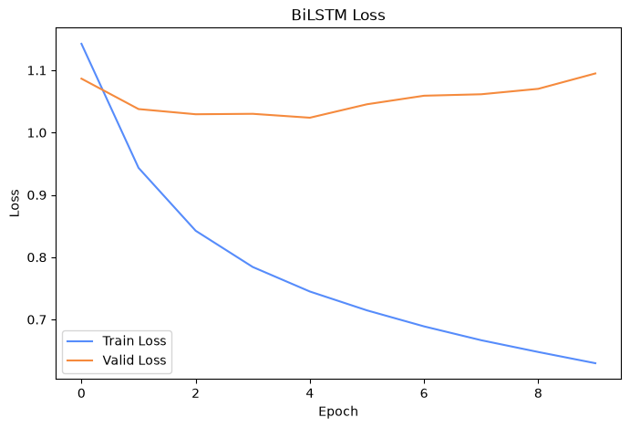
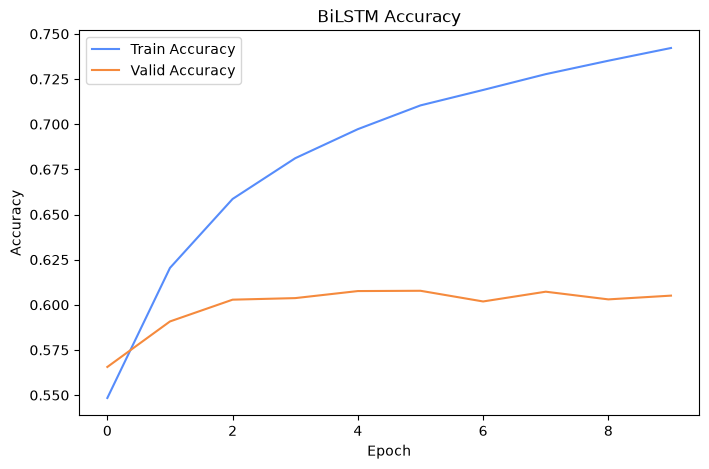

# 电影评论情感五分类（BiLSTM）

本目录保存一个基于 PyTorch BiLSTM 的电影评论情感分类练习。实验使用 Kaggle **Sentiment Analysis on Movie Reviews** 数据，将英文短语划分为 5 个情感类别：

| 标签 | 含义 |
|---:|---|
| 0 | negative |
| 1 | somewhat negative |
| 2 | neutral |
| 3 | somewhat positive |
| 4 | positive |

> Notebook、数据压缩包、模型权重和提交文件均按本地实验文件原样归档，没有修改代码、注释、超参数或已保存输出。

## 文件说明

| 文件 | 说明 |
|---|---|
| [电影评价分类.ipynb](./电影评价分类.ipynb) | 完整的数据处理、BiLSTM 训练、验证和 Kaggle 提交文件生成流程 |
| [train.tsv.zip](./train.tsv.zip) | Notebook 使用的训练数据 |
| [test.tsv.zip](./test.tsv.zip) | Notebook 使用的 Kaggle 测试数据 |
| [sampleSubmission.csv](./sampleSubmission.csv) | Kaggle 提交格式示例 |
| [submission.csv](./submission.csv) | Notebook 已生成的预测提交文件 |
| [best_movie_bilstm.pth](./best_movie_bilstm.pth) | 按最高验证准确率保存的模型参数 |
| [bilstm_loss.png](./images/bilstm_loss.png) | Notebook 已保存输出中的训练/验证损失曲线 |
| [bilstm_accuracy.png](./images/bilstm_accuracy.png) | Notebook 已保存输出中的训练/验证准确率曲线 |

数据来源对应 Kaggle [Sentiment Analysis on Movie Reviews](https://www.kaggle.com/c/sentiment-analysis-on-movie-reviews)。使用或再分发数据时请同时遵守 Kaggle 页面及竞赛规则。

## 模型与数据流程

```text
Phrase
  ↓ 小写并按空格分词
词表索引（<PAD>=0，<UNK>=1）
  ↓ 每个 batch 动态 padding
Embedding(vocab_size, 64)
  ↓
双向 LSTM(hidden_size=64)
  ↓
拼接正向、反向最终隐藏状态
  ↓
Dropout(0.5)
  ↓
Linear(128, 5)
  ↓
五类情感 logits
```

Notebook 中的核心双向表示来自：

```python
forward_hidden = hidden[-2]
backward_hidden = hidden[-1]
hidden = torch.cat([forward_hidden, backward_hidden], dim=1)
```

## 训练设置

- 随机种子：`42`
- 划分单位：`SentenceId`
- 训练/验证比例：`80% / 20%`
- Batch size：`64`
- Embedding dimension：`64`
- Hidden size：`64`
- 优化器：Adam，`lr=0.001`
- 损失函数：`CrossEntropyLoss`
- 训练轮数：`10`
- 最佳模型：按验证准确率保存为 `best_movie_bilstm.pth`

按 `SentenceId` 划分可以避免同一个完整句子的多个短语同时出现在训练集与验证集，降低数据泄漏风险。

## 已保存运行结果

| Epoch | Train Loss | Train Acc | Valid Loss | Valid Acc |
|---:|---:|---:|---:|---:|
| 1 | 1.1424 | 54.84% | 1.0865 | 56.56% |
| 2 | 0.9433 | 62.04% | 1.0377 | 59.08% |
| 3 | 0.8424 | 65.86% | 1.0294 | 60.29% |
| 4 | 0.7842 | 68.12% | 1.0301 | 60.37% |
| 5 | 0.7449 | 69.72% | 1.0238 | 60.76% |
| 6 | 0.7147 | 71.04% | 1.0454 | **60.78%** |
| 7 | 0.6889 | 71.89% | 1.0591 | 60.19% |
| 8 | 0.6668 | 72.77% | 1.0614 | 60.73% |
| 9 | 0.6478 | 73.51% | 1.0702 | 60.30% |
| 10 | 0.6299 | 74.22% | 1.0948 | 60.51% |

最高验证准确率为 **60.78%（Epoch 6）**。训练准确率持续上升，而后期验证损失升高，说明模型在第 6 轮后出现了较明显的过拟合趋势。





> 两张图直接提取自 Notebook 中已经保存的真实输出，没有重新绘制或补造数据。原代码用列表下标作横轴，因此图中的横轴显示为 `0–9`，分别对应训练的第 `1–10` 轮。

Notebook 最终加载最佳权重，对 `test.tsv.zip` 生成了 66,292 条预测，并写入 `submission.csv`。该文件已经通过格式检查，但目录中没有保存 Kaggle 在线提交分数，因此 README 不声明任何 leaderboard 成绩。

## 运行方法

在本目录启动 Jupyter：

```bash
jupyter lab
```

打开 `电影评价分类.ipynb` 后按顺序运行两个单元格。需要安装：

```bash
python -m pip install pandas matplotlib torch jupyter
```

Notebook 使用相对路径读取本目录中的 `train.tsv.zip`、`test.tsv.zip` 和 `best_movie_bilstm.pth`。如果没有 CUDA，会自动使用 CPU。

## 结果边界

- `Valid Acc` 来自本地按 `SentenceId` 划分的验证集，不是 Kaggle 隐藏测试集成绩。
- Kaggle 测试数据没有公开标签，`submission.csv` 只能在 Kaggle 提交后获得官方评分。
- 词表由完整 `train.tsv.zip` 构建，然后再划分训练/验证数据；这不会使用验证标签，但会让验证集词汇提前进入词表。若需要更严格的泛化评估，应只用训练子集构建词表。
- 本目录用于记录个人学习实验，不代表课程官方实现。

