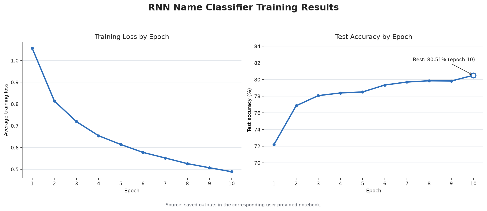
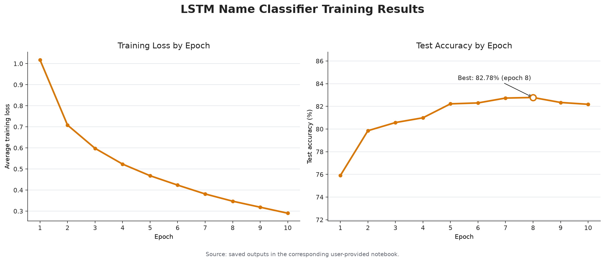
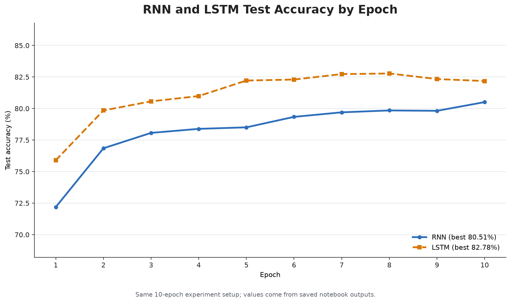

# RNN 与 LSTM 人名国家分类实验

这个实验使用字符级序列模型，根据人名预测其所属国家类别。目录中保留了用户完成的 RNN 与 LSTM 两个 Jupyter Notebook，并附带它们实际运行输出生成的训练效果图。

## 目录

```text
NameClassifier_RNN_LSTM/
├── RNN人名分类器 RNN版.ipynb
├── RNN人名分类器 LSTM版.ipynb
├── data/
│   ├── names_train.csv.gz
│   └── names_test.csv.gz
├── images/
│   ├── rnn_training_results.png
│   ├── lstm_training_results.png
│   └── rnn_lstm_test_accuracy_comparison.png
└── README.md
```

两份 Notebook 及其中文注释、训练逻辑、超参数和已保存输出均保持原样。`data/` 中保留运行所需的数据文件，使 Notebook 里的相对路径 `data/names_train.csv.gz` 和 `data/names_test.csv.gz` 可以直接使用。

## 数据处理流程

1. 使用 `gzip.open(..., "rt")` 和 `csv.reader` 读取压缩 CSV。
2. 通过 `country_dict` 将 18 个国家标签编码为 `0` 到 `17`。
3. 建立 57 个字符组成的字符表：

   ```text
   a-z + A-Z + 空格、点、逗号、分号、单引号
   ```

4. 将人名逐字符转换为整数索引，再交给 Embedding。
5. 由于名字长度不同，实验不组成批次，而是每次训练和测试一个名字。

## 模型结构

两种模型共享以下数据流：

```text
人名字符串
  → 字符索引
  → Embedding(57, 64)
  → RNN 或 LSTM(64, 64)
  → 最后一层隐藏状态
  → Linear(64, 18)
  → 国家类别分数
```

主要区别：

| 项目 | RNN | LSTM |
|---|---|---|
| PyTorch 模块 | `nn.RNN` | `nn.LSTM` |
| 最终状态 | `hidden` | `hidden` 与 `cell` |
| 分类使用 | 最后隐藏状态 | 最后隐藏状态 |
| 长期信息管理 | 直接递归更新隐藏状态 | 通过门控和细胞状态管理 |

## 训练设置

| 参数 | 设置 |
|---|---|
| 隐藏维度 | 64 |
| 输出类别 | 18 |
| 损失函数 | `CrossEntropyLoss` |
| 优化器 | Adam |
| 学习率 | 0.0005 |
| 训练轮数 | 10 |
| 训练方式 | 单样本更新，每轮随机打乱 |
| 最佳模型选择 | 每轮准确率更高时保存参数 |

## 实验结果

### RNN

Notebook 已保存输出中的最佳测试准确率为 **80.51%**，出现在第 10 轮；对应平均训练损失为 **0.4888**。



### LSTM

Notebook 已保存输出中的最佳测试准确率为 **82.78%**，出现在第 8 轮；对应平均训练损失为 **0.3470**。第 10 轮训练损失继续下降到 0.2900，但测试准确率回落到 82.18%，说明继续拟合训练集并没有继续改善当前测试集表现。



### 两种模型对比

本次运行中，LSTM 的最佳准确率比 RNN 高 **2.27 个百分点**。



这些图直接解析两个 Notebook 中保存的每轮 Loss 与 Accuracy 输出生成，没有补造或重新估算训练指标。

## 运行方法

从仓库根目录启动 Jupyter：

```bash
jupyter lab
```

进入：

```text
Chapter13_RNNClassifier/NameClassifier_RNN_LSTM/
```

然后打开任一 Notebook 并从头运行：

- `RNN人名分类器 RNN版.ipynb`
- `RNN人名分类器 LSTM版.ipynb`

Notebook 会在当前目录保存：

```text
best_rnn_name_classifier.pth
```

> 两个 Notebook 使用同一个模型文件名。依次运行时，后运行的 Notebook 会覆盖前一个模型参数文件。如果需要同时保留两个最佳模型，请在本地分别重命名生成的 `.pth` 文件。

## 结果解释与限制

- RNN 与 LSTM 的结果来自两次独立训练，且代码没有固定随机种子；重新运行时准确率可能略有变化。
- 代码每轮都读取 `names_test.csv.gz` 计算准确率，并用该准确率选择最佳模型。因此该文件在实验流程中更接近验证集，而不是完全独立、只使用一次的最终测试集。
- 模型学习的是字符组合和常见姓氏后缀等模式，并不能确定一个真实人物的国籍。
- 自定义预测仅在字符表包含输入字符时安全；字符表以外的字符会使 `find()` 返回 `-1`，不适合直接送入 Embedding。

## Notebook 来源校验

导入时保留的原文件 SHA-256：

```text
RNN人名分类器 RNN版.ipynb
AF0E546BD5D1CB6C49C6EF7B4C6AE3024E2C8A8CD3165AB47757190C3857C7C6

RNN人名分类器 LSTM版.ipynb
FEB94FCA24743C30831345B15D15B594FC213A22C9FAAF09B2ACBEC2D08ED73F
```
