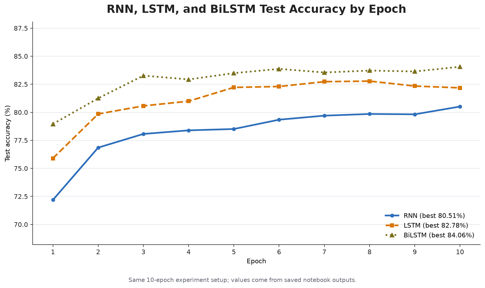

# 第 13 章：循环神经网络分类器

本章在课程课件的基础上，补充了一个人名国家分类实验：输入英文字符组成的人名，模型依次读取字符，并在 18 个国家类别中给出预测。

## 本章资料

- [课程课件：Lecture 13 RNN Classifier](./Lecture_13_RNN_Classifier.pdf)
- [RNN、LSTM 与 BiLSTM 人名分类实验](./NameClassifier_RNN_LSTM/README.md)
- [BiLSTM 电影评论情感五分类实验](./MovieReviewSentiment_BiLSTM/README.md)

## 实验概览

实验包含三个保持相同数据处理、训练轮数和优化器设置的 Notebook：

| 模型 | Notebook | 已保存输出中的最佳准确率 |
|---|---|---:|
| RNN | [RNN 人名分类器](./NameClassifier_RNN_LSTM/RNN%E4%BA%BA%E5%90%8D%E5%88%86%E7%B1%BB%E5%99%A8%20RNN%E7%89%88.ipynb) | 80.51% |
| LSTM | [LSTM 人名分类器](./NameClassifier_RNN_LSTM/RNN%E4%BA%BA%E5%90%8D%E5%88%86%E7%B1%BB%E5%99%A8%20LSTM%E7%89%88.ipynb) | 82.78% |
| BiLSTM | [BiLSTM 人名分类器](<./NameClassifier_RNN_LSTM/RNN 人名分类器  BiLSTM版.ipynb>) | 84.06% |

> 上表和曲线来自 Notebook 中已经保存的真实运行输出。代码在每一轮都使用 `names_test.csv.gz` 计算准确率并选择最佳模型，因此这里的“测试集”实际上同时承担了验证集的作用；这些数字适合比较本次实验中的三个模型，但不应当视为独立最终测试集上的无偏估计。

## 核心知识点

- 使用 `Dataset` 读取 `.csv.gz` 格式的人名与国家标签。
- 将字符映射为整数索引，再通过 `nn.Embedding` 学习字符向量。
- 使用最后一个隐藏状态完成整个人名的 18 类分类。
- 对比 `nn.RNN`、单向 `nn.LSTM` 与设置 `bidirectional=True` 的双向 LSTM。
- 理解 BiLSTM 如何通过 `torch.cat([forward_hidden, backward_hidden], dim=1)` 合并两个方向的最终隐藏状态。
- 每轮打乱训练样本，避免按国家分组的固定数据顺序影响单样本训练。
- 按每轮准确率保存最佳模型参数。

详细目录、运行方法、结果图和复现实验说明见[实验 README](./NameClassifier_RNN_LSTM/README.md)。

## 扩展实践：电影评论情感五分类

[电影评论情感五分类实验](./MovieReviewSentiment_BiLSTM/README.md)将字符级人名分类扩展到词级文本分类，包含：

- 通过 `Counter` 构建词表，并设置 `<PAD>` 与 `<UNK>`。
- 使用自定义 `collate_fn` 对每个 batch 进行动态 padding。
- 使用 `SentenceId` 划分训练集和验证集，避免同一句子的短语跨集合泄漏。
- 通过 BiLSTM 同时提取正向和反向文本信息。
- 生成 Kaggle 格式的 `submission.csv`。

Notebook 已保存的最高验证准确率为 **60.78%（Epoch 6）**。训练后期训练准确率继续上升，而验证损失逐步升高，表现出过拟合趋势；详细曲线、训练设置和结果边界见[项目 README](./MovieReviewSentiment_BiLSTM/README.md)。
